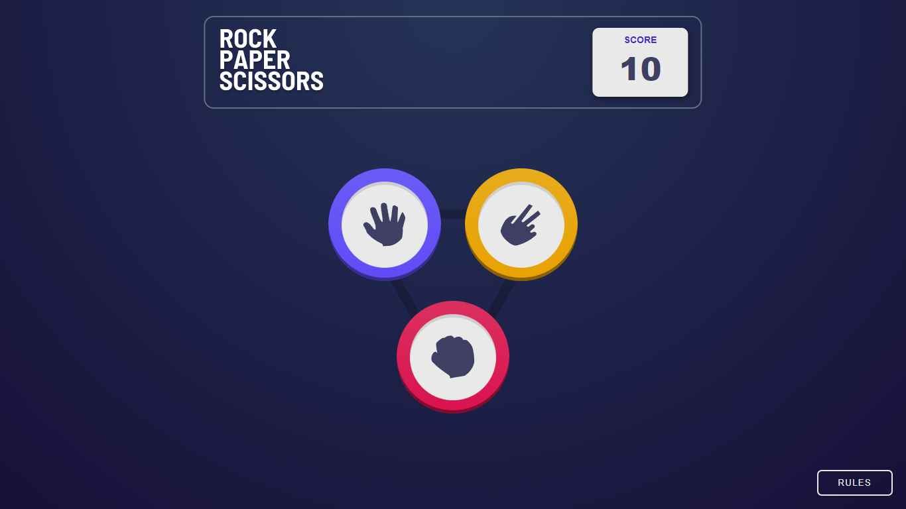
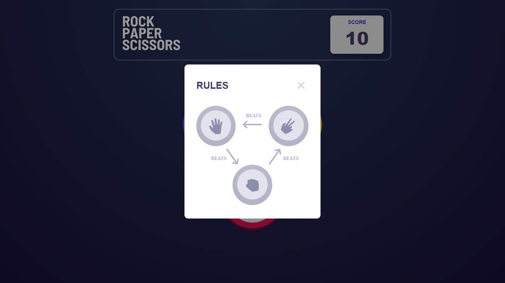
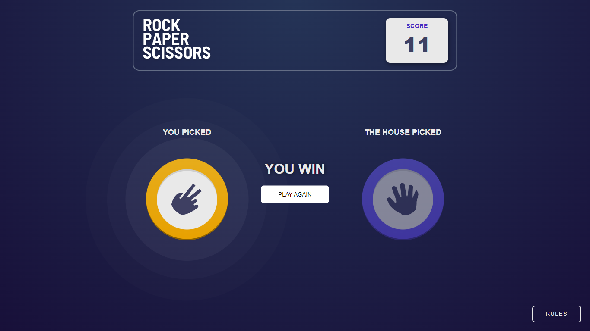
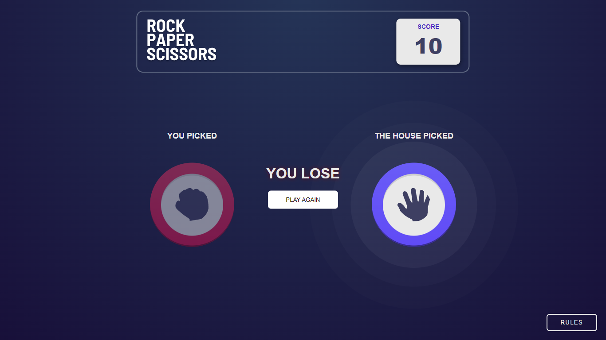
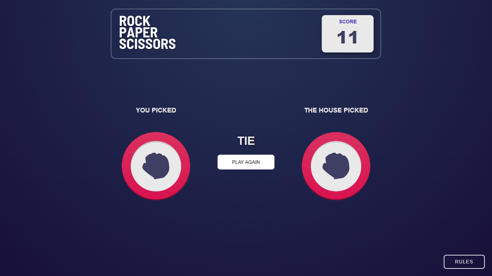
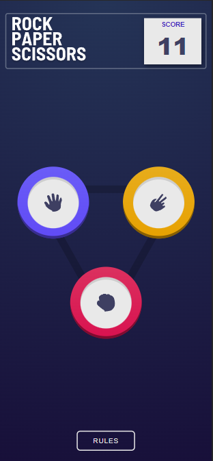
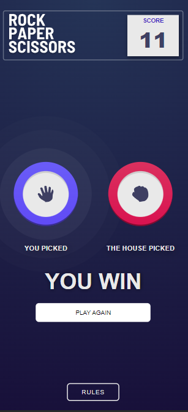
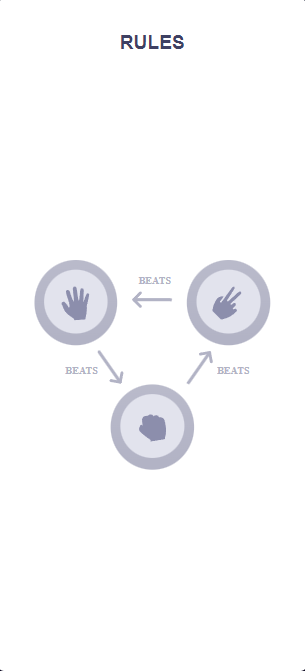

# Frontend Mentor - Rock, Paper, Scissors solution

This is a solution to the [Rock, Paper, Scissors ](https://www.frontendmentor.io/challenges/rock-paper-scissors-game-pTgwgvgH).

## Table of contents

- [Screenshot](#screenshot)
- [Links](#links)
- [Built with](#built-with)
- [Author](#author)

### Screenshot

### Links

- Solution URL: [https://www.frontendmentor.io/solutions/resposive-app-react-sass-b58nDJdt-X](https://www.frontendmentor.io/solutions/resposive-app-react-sass-b58nDJdt-X)
- Live Site URL: [https://magical-duckanoo-d9dbfc.netlify.app/](https://magical-duckanoo-d9dbfc.netlify.app/)

### Built with

- [React](https://reactjs.org/) - JS library
- [Sass](https://sass-lang.com/) - Sass

## Author

- Frontend Mentor - [@AltamiroF-22](https://www.frontendmentor.io/profile/AltamiroF-22)
- Istagram - [@junior.rx22](https://www.instagram.com/junior.rx22/)
